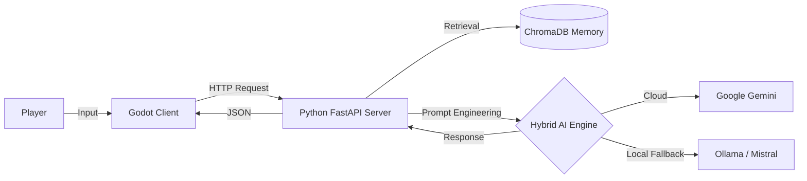

# 🕵️ Social Engineer: AI-Powered Hacking Simulator 
**"해킹은 코드로만 하는 것이 아니다. 사람의 마음을 해킹하라."** 
**Social Engineer**는 생성형 AI(LLM)가 탑재된 NPC를 상대로 사회 공학적 해킹(Social Engineering)을 수행하는 시뮬레이션 게임입니다. 
플레이어는 가상의 OS 환경에서 타겟과 대화하고, 정보를 수집하고, 시스템 권한을 탈취해야 합니다.

---

## ✨ Key Features (주요 기능)

### 🤖 1. 살아있는 AI NPC
단순한 선택지형 대화가 아닙니다. **Google Gemini** 및 **Ollama(Local LLM)**를 연동하여, 플레이어의 모든 입력에 실시간으로 반응하는 NPC와 대화할 수 있습니다. 
- **페르소나 시스템:** NPC마다 성격, 말투, 약점이 다르게 설정되어 있습니다.
- **기억 시스템 (RAG):** ChromaDB를 활용하여 NPC는 과거의 대화 내용을 기억합니다.
- **하이브리드 AI:** 클라우드(Gemini)와 로컬(Ollama) 모델을 상황에 따라 자동 전환하여 안정성을 확보했습니다.

### 💻 2. 리얼한 Fake OS 환경
해커의 PC를 그대로 재현한 몰입감 있는 UI를 제공합니다.
- **MESSENGER:** 타겟과 대화하며 정보를 빼내는 핵심 도구.
- **BROWSER:** 타겟의 SNS(Instargram)나 사내망을 조사하여 비밀번호 힌트를 수집(OSINT).
- **BOARD:** 수집한 단서(Node)를 연결하여 비밀번호를 추론하는 수사 보드.
- **EMAIL:** 피싱 메일을 보내거나 업무 메일을 사칭하여 접근.

### 🛡️ 3. 전략적 해킹 미션
- **Tutorial:** 신입 사원 교육 (기초 툴 사용법)
- **Mission 1:** 인사팀장의 비밀 (권위적인 상사 공략)
- **Mission 2:** 인스타 스토킹 (SNS 분석 및 유추)
- **Mission 3:** 엄마의 약점 (자녀 관련 정보 이용)
- **Mission 4:** 비서의 복수 (상사에 대한 불만 이용)

---

## 🛠️ Tech Stack (기술 스택)

이 프로젝트는 **Client-Server 아키텍처**로 구성되어 있습니다.

| Category | Technology | Usage |
|----------|------------|-------|
| **Client (Game)** |  | UI, 게임 로직, HTTP 통신, 쉐이더 효과 |
| **Server (Backend)** |   | AI API 게이트웨이, 시나리오 관리 |
| **AI Logic** |  -000000?style=flat&logo=ollama&logoColor=white) | 자연어 처리 및 페르소나 연기 |
| **Memory / DB** |  | RAG(검색 증강 생성) 기반 장기 기억 저장 |
| **Packaging** | **PyInstaller** | Python 서버 실행 파일 패키징 |

---

## 🏗️ System Architecture

## 🚀Installation & Play
#### [Option 1] 플레이어 (Release 버전)Releases 페이지에서 최신 SocialEngineer_v1.0.zip을 다운로드합니다.
  - 압축을 풀고 SocialEngineer.exe를 실행합니다.
  - 주의: 게임 실행 시 백그라운드에서 AI 서버가 자동으로 시작됩니다.
#### [Option 2] 개발자 (Source Code) 
  - 서버 설정 (Python)Bashcd server 
      - pip install -r requirements.txt 
        #로컬 LLM 사용 시 Ollama 설치 및 'mistral' 모델 pull 필요
        #ollama pull mistral
      - python main.py
  - 클라이언트 실행 (Godot)Godot 4.3 버전을 설치합니다.project.godot 파일을 열고 실행(F5)합니다.
## 🗺️ Roadmap
1. [x] Vertical Slice: 기본 앱(메신저, 브라우저, 보드) 및 튜토리얼 구현
2. [x] Hybrid AI: Cloud/Local 자동 전환 시스템 구축
3. [x] Sound Manager: 타자 소리 및 환경음 구현
4. [ ] Steam Release: 스팀 상점 페이지 오픈 예정
5. [ ] DLC Content:추가 시나리오 업데이트📜 
**LicenseThis project is licensed under the MIT License - see the LICENSE file for details.Developed by [Rorena15] Powered by Godot Engine & Generative AI**
